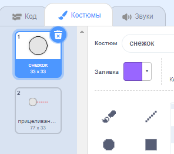

## Подготовка снежка

Давай сделаем снежок, который можно бросить в пределах сцены.

--- task ---

Открой стартовый проект Scratch.

**Онлайн**: открыть [стартовый проект](https://scratch.mit.edu/projects/505334050){:target="_ blank"}.

Если у тебя есть учётная запись в Scratch, то ты можешь сделать копию проекта, нажав **Ремикс**.

**Оффлайн**: открыть [стартовый проект](https://rpf.io/p/ru-RU/snowball-fight-go){:target="_blank"} в оффлайн-редакторе.

Если тебе необходимо скачать и установить оффлайн редактор Scratch, ты можешь найти его по адресу [rpf.io/scratchoff](https://rpf.io/scratchoff){:target="_blank"}.

В стартовом проекте ты должен увидеть пустую сцену и спрайт снежка.

--- /task ---

--- task ---

Спрайт "Снежок" содержит 2 костюма: обычный костюм и тот, который указывает направление броска снежка.



--- /task ---

--- task ---

Для начала, давай дадим игроку возможность изменять угол броска. Добавь этот код в спрайт "Снежок":


```blocks3
when flag clicked
wait (0.5) seconds
go to x:(-200) y:(-130)
point in direction (90)
switch costume to (прицеливание снежка v)
repeat until <mouse down?>
    point towards (mouse-pointer v)
end
```

--- /task ---

--- task ---

Проверь свой проект, нажав на зеленый флажок. Ты должен увидеть, что твой снежок следует за указателем мыши, пока ты удерживаешь кнопку мыши.


--- /task ---

--- task ---

Давай также дадим игроку возможность выбирать с какой силой будет брошен снежок. Создай новую переменную `сила`{:class="block3variables"}.

[[[generic-scratch3-add-variable]]]

--- /task ---

--- task ---

Перемести созданное окно с переменной сила в нижнюю часть сцены вблизи снежка. Щелкни правой кнопкой мыши по окну с переменной и нажми «рычажок».


--- /task ---

--- task ---

Добавь следующий код чтобы установить значение 0 для переменной `сила`{:class="block3variables"} при нажатии на флажок.


```blocks3
when flag clicked
+ set [сила v] to (0)
```

--- /task ---

--- task ---

Теперь, когда задана переменная `сила`{:class="block3variables"}, ты можешь увеличить силу броска _после_ того, как было выбрано направление броска с помощью следующего кода:


```blocks3
repeat until <mouse down?>
    point towards (mouse-pointer v)
end
+repeat until < not <mouse down?> >
    point towards (mouse-pointer v)
    change [сила v] by (1)
    wait (0.1) seconds
end
```

Данный код означает, что ты должен _удерживать нажатой кнопку мыши_ после выбора направления броска, чтобы определить силу с которой он будет брошен.

--- /task ---

--- task ---

Проверь снежок, чтобы убедиться, что ты можешь выбирать направление и силу броска.


--- /task ---
