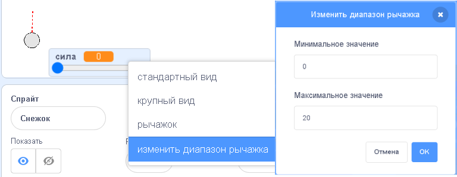

## Реалистичное движение

Теперь, когда у тебя есть снежок, давай сделаем его движение более реалистичным.

--- task ---

Для начала, давай зададим максимальный уровень силы, чтобы нельзя было бросить снежок слишком сильно.

В части твоего кода для блока `когда нажат флажок`{:class="block3events"} нам необходимо указать увеличение силы только если она меньше 20. Измени свой код на представленный ниже:


```blocks3
repeat until< not <mouse down?> >
+   if < (power) < [20] > then
        change [power v] by (1)
        wait (0.1) seconds
    end
end
```

--- /task ---

--- task ---

Снова проверь свой снежок, и ты увидишь, что мощность никогда не превышает 20.

--- /task ---

--- task ---

Теперь, когда максимальная сила броска 20, ты можешь задать данное значение как максимальное для рычажка переменной. Щелкни правой кнопкой мыши на переменной сила и выбери «изменить диапазон рычажка».




--- /task ---

--- task ---

Также ты можешь замедлить снежок, слегка уменьшая силу, когда он летит по воздуху. Добавь следующий блок кода в код твоего снежка `когда я получу [throw]`{:class="block3events"}:


```blocks3
when I receive [throw v]
switch costume to (snowball v)
repeat until < touching [edge v]? >
    move (power) steps
+   change [power v] by (-0.25)
end
hide
```

--- /task ---


--- task ---

Протестируй получившийся код. Работает ли он, как предполагалось? Ты можешь заметить, что сила продолжает уменьшатся, и в итоге снежок летит обратно!

Чтобы это исправить, ты можешь добавить блок `если`{:class="block3control"} к своему коду, таким образом сила уменьшается только в случае, когда ее значение больше 0:


```blocks3
when I receive [throw v]
switch costume to (snowball v)
repeat until < touching [edge v]? >
    move (power) steps
+   if < (power) > (0) > then
        change [power v] by (-0.25)
    end
end
hide
```

--- /task ---

--- task ---

Почти все готово, но осталось добавить влияние гравитации, чтобы снежок падал на землю. Ты можешь добавить данный эффект, просто обеспечив непрерывное движение снежка вниз с помощью следующего кода:


```blocks3
when I receive [throw v]
switch costume to (snowball v)
repeat until < touching [edge v]? >
+   change y by (-5)
    move (power) steps
    if < (power) > (0) > then
        change [power v] by (-0.25)
    end
end
hide
```

--- /task ---

--- task ---

Повтори испытание снежка, ты должен заметить, что снежок стал двигаться намного реалистичнее.

--- /task ---

