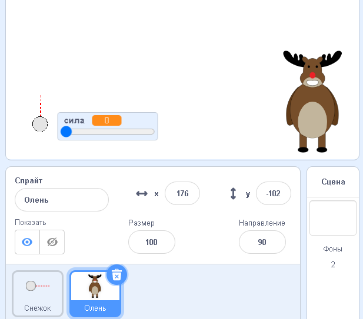

## Цель

Давай добавим цель для твоих снежков!

--- task ---

Добавь ещё один спрайт в свой проект.



[[[generic-scratch3-sprite-from-library]]]

--- /task ---

--- task ---

Добавь следующий код к новому спрайту, теперь он говорит "Ты попал!" при удачном попадании снежка:


```blocks3
when flag clicked
forever
    if < touching [snowball v]? > then
        say [You got me!] for (1) seconds
    end
end
```

--- /task ---

--- task ---

Проверь свой новый код.


--- /task ---

--- task ---

Давай добавим пару деталей, чтобы сделать игру сложнее. Для начала, пускай олень будет перемещаться каждый раз, когда игрок бросает снежок.

Для этого в верхней части `бесконечного`{:class="block3control"} цикла добавь команду `передать`{:class="block3control"} для снежка. Это позволит твоему оленю понять, что скоро произойдет выстрел.


```blocks3
when flag clicked
forever
set [power v] to (0)
+broadcast (new shot v)
wait (0.5) seconds
go to x:(-200) y:(-130)
point in direction (90)
switch costume to (snowball-aim v)
show
repeat until <mouse down?>
    point towards (mouse-pointer v)
end
repeat until < not <mouse down?> >
    point towards (mouse-pointer v)
    change [power v] by (1)
    wait (0.1) seconds
end
broadcast (throw v) and wait
end
```

Добавь следующий код, чтобы переместить оленя в случайную позицию, после того, как он получит сообщение:


```blocks3
when I receive [new shot v]
set x to (pick random (0) to (200))
```

--- /task ---

--- task ---

Проверь свой проект, бросив несколько снежков. Перемещается ли цель после каждого броска?

--- /task ---

--- task ---

Ты также можешь усложнить свою игру, добавив перед снежком препятствие в виде камня.


--- /task ---

--- task ---

Теперь ты можешь изменить код снежка таким образом, чтобы он останавливался при касании края экрана _или_ камня.


```blocks3
when I receive [throw v]
switch costume to (snowball v)
+ repeat until << touching [edge v]? > or <touching [Rocks v]?>>
    change y by (-5)
    move (power) steps
    if <(power) > [0]> then
    change [power v] by (-0.25)
    end
end
hide
```

--- /task ---

--- task ---

Наконец, уменьшение снежка и оленя сделает твою игру еще более сложной.


--- /task ---
