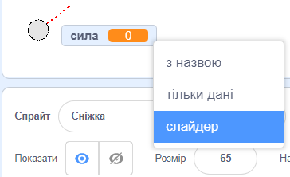
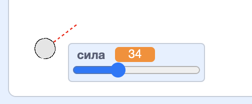

## Створення сніжки

Давай створимо сніжку, якою можна кидатися на сцені.

--- task ---

Відкрий початковий проєкт у Скретч.

**Онлайн**: відкрий [початковий проєкт](https://scratch.mit.edu/projects/399260066){:target="_blank"}.

Якщо у тебе є обліковий запис Скретч, то ти можеш зробити копію проєкту, натиснувши **Ремікс**.

**Офлайн**: відкрий [початковий проєкт](http://rpf.io/p/uk-UA/snowball-fight-go){:target="_blank"} в офлайн-редакторі.

Якщо тобі треба завантажити та встановити офлайн-редактор Скретч, то ти можеш його знайти на [rpf.io/scratchoff](http://rpf.io/scratchoff){:target="_blank"}.

В початковому проєкті ти маєш побачити порожню сцену та спрайт сніжки.

--- /task ---

--- task ---

Спрайт "Сніжка" має 2 образи: звичайний костюм та костюм з прицілом.


--- /task ---

--- task ---

Спочатку давай дозволимо гравцеві змінювати кут польоту сніжки. Додай цей код до свого спрайта сніжки:


```blocks3
when flag clicked
wait (0.5) seconds
go to x:(-200) y:(-130)
point in direction (90)
switch costume to (сніжка з прицілом v)
repeat until <mouse down?>
    point towards (mouse-pointer v)
end
```

--- /task ---

--- task ---

Протестуй свій проєкт, клацнувши на зелений прапор. Ти повинен бачити, як сніжка вказує на мишку, поки ти не натиснеш клавішу мишки.


--- /task ---

--- task ---

Давай також дозволимо гравцеві вирішувати, наскільки сильно треба кидати сніжку. Створи нову змінну із назвою `сила`{:class="block3variables"}.

[[[generic-scratch3-add-variable]]]

--- /task ---

--- task ---

Перетягни відображення нової змінної вниз сцени поруч зі сніжкою. Клацни правою кнопкою мишки по відображенню змінної та вибери "слайдер".



--- /task ---

--- task ---

Додай код, щоб встановлювати значення нової змінної `сила`{:class="block3variables"} рівним 0, коли натискають зелений прапор.


```blocks3
when flag clicked
+ set [power v] to (0)
```

--- /task ---

--- task ---

Тепер, коли в тебе з’явилася змінна `сила`{:class="block3variables"}, ти можеш збільшувати силу кидка сніжки _після_ того, як вибрано напрям, за допомогою наступного коду:


```blocks3
repeat until <mouse down?>
    point towards (mouse-pointer v)
end
+repeat until < not <mouse down?> >
    point towards (mouse-pointer v)
    change [сила v] by (1)
    wait (0.1) seconds
end
```

Цей код означає, що після вибору напрямку, ти маєш _утримувати клавішу мишки натиснутою_ для задання сили кидка сніжки.

--- /task ---

--- task ---

Протестуй свою сніжку, щоб впевнитися, що ти можеш задавати напрям та силу.



--- /task ---
