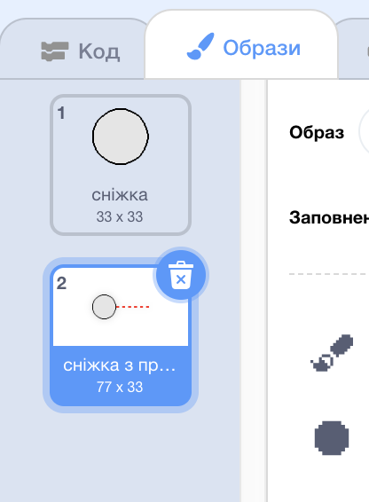

## Створення сніжки

Давай створимо сніжку, якою можна кидатися на сцені.

--- task ---

Відкрий початковий проєкт у Скретч.

**Онлайн**: відкрий [початковий проєкт](http://rpf.io/snowball-fight-on){:target="_blank"}.

Якщо у тебе є обліковий запис Скретч, то ти можеш зробити копію проєкту, натиснувши **Ремікс**.

**Офлайн**: відкрий [початковий проєкт](http://rpf.io/p/en/snowball-fight-go){:target="_blank"} в офлайн-редакторі.

Якщо тобі треба завантажити та встановити офлайн-редактор Скретч, то ти можеш його знайти на [rpf.io/scratchoff](http://rpf.io/scratchoff){:target="_blank"}.

В початковому проєкті ти маєш побачити порожню сцену та спрайт сніжки.

--- /task ---

--- task ---

Спрайт "Сніжка" має 2 образи: звичайний костюм та костюм з прицілом.



--- /task ---

--- task ---

Спочатку давай дозволимо гравцеві змінювати кут польоту сніжки. Додай цей код до свого спрайта сніжки:


```blocks3
when flag clicked
wait (0.5) seconds
go to x:(-200) y:(-130)
point in direction (90)
switch costume to (snowball-aim v)
repeat until <mouse down?>
    point towards (mouse-pointer v)
end
```

--- /task ---

--- task ---

Протестуй свій проєкт, клацнувши на зелений прапор. Ти повинен бачити, як сніжка вказує на мишку, поки ти не натиснеш клавішу мишки.


--- /task ---

--- task ---

Давай також дозволимо гравцеві вирішувати, наскільки сильно треба кидати сніжку. Створи нову змінну із назвою `сила`{:class="block3variables"}.

[[[generic-scratch3-add-variable]]]

--- /task ---

--- task ---

Перетягни відображення нової змінної вниз сцени поруч зі сніжкою. Клацни правою кнопкою мишки по відображенню змінної та вибери "слайдер".


--- /task ---

--- task ---

Add code to set your new `power`{:class="block3variables"} variable to 0 when the flag is clicked.


```blocks3
when flag clicked
+ set [power v] to (0)
```

--- /task ---

--- task ---

Now that you have a `power`{:class="block3variables"} variable, you can increase the power of the snowball _after_ the direction has been chosen with this code:


```blocks3
repeat until <mouse down?>
    point towards (mouse-pointer v)
end
+repeat until < not <mouse down?> >
    point towards (mouse-pointer v)
    change [power v] by (1)
    wait (0.1) seconds
end
```

This code means that you have to _keep the mouse button held down_ after choosing the direction, to choose the snowball's power.

--- /task ---

--- task ---

Test your snowball, to see if you can choose its angle and power.


--- /task ---
