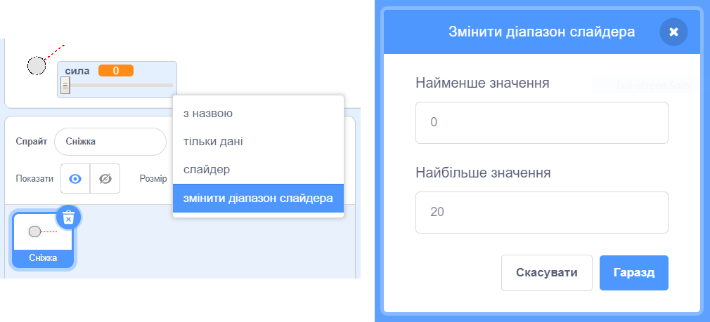

## Реалістичний рух

Тепер в тебе є сніжка, але давай зробимо, щоб вона рухалася трохи більш реалістично.

--- task ---

Спочатку встановимо максимальну силу, щоб сніжку не можна було кинути занадто сильно.

В коді для сніжки `коли прапор натиснуто`{:class="block3events"} нам потрібно збільшувати силу, тільки якщо вона менша за 20. Зміни свій код:


```blocks3
repeat until< not <mouse down?> >
+   if < (power) < [20] > then
        change [power v] by (1)
        wait (0.1) seconds
    end
end
```

--- /task ---

--- task ---

Протестуй сніжку знову, і ти побачиш, що сила ніколи не піднімається вище 20.

--- /task ---

--- task ---

Тепер, коли максимальна сила для сніжки дорівнює 20, ти також можеш встановити це значення як максимальне для змінної слайдера. Клацни правою кнопкою мишки на змінній сили і вибери "змінити діапазон слайдера".




--- /task ---

--- task ---

Також ти можеш сповільнювати сніжку, потроху знижуючи силу, поки вона летить у повітрі. Додай наступний блок до коду сніжки `коли я отримую [кидок]`{:class="block3events"}:


```blocks3
when I receive [throw v]
switch costume to (snowball v)
repeat until < touching [edge v]? >
    move (power) steps
+   change [power v] by (-0.25)
end
hide
```

--- /task ---


--- task ---

Test this new code - does it work as you expected? You may notice that the power keeps reducing, and eventually the snowball moves backwards!

To fix this, you can add an `if`{:class="block3control"} block to your code, so that the power is only lowered if it is above 0:


```blocks3
when I receive [throw v]
switch costume to (snowball v)
repeat until < touching [edge v]? >
    move (power) steps
+   if < (power) > (0) > then
        change [power v] by (-0.25)
    end
end
hide
```

--- /task ---

--- task ---

You're nearly there, but you also need to add some gravity to your snowball, so that it falls to the ground. You can add gravity by just moving the snowball down continuously with this code:


```blocks3
when I receive [throw v]
switch costume to (snowball v)
repeat until < touching [edge v]? >
+   change y by (-5)
    move (power) steps
    if < (power) > (0) > then
        change [power v] by (-0.25)
    end
end
hide
```

--- /task ---

--- task ---

Test out your snowball again, and you should see that your snowball moves much more realistically.

--- /task ---

