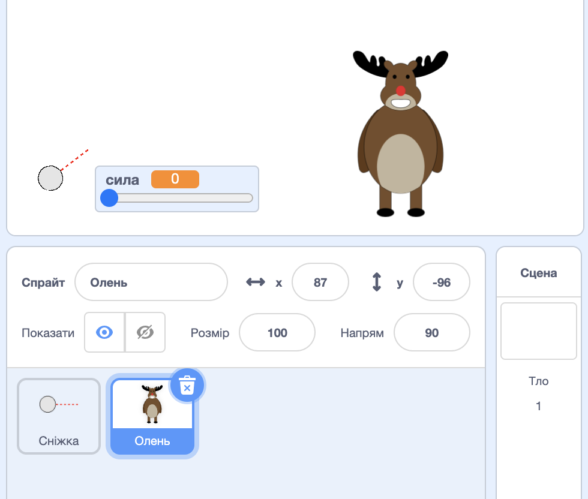
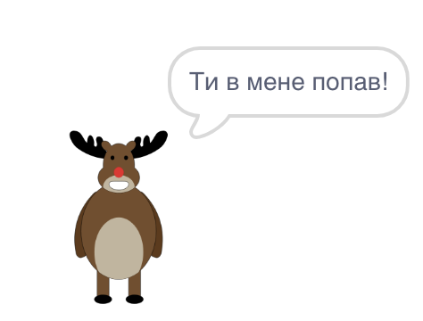
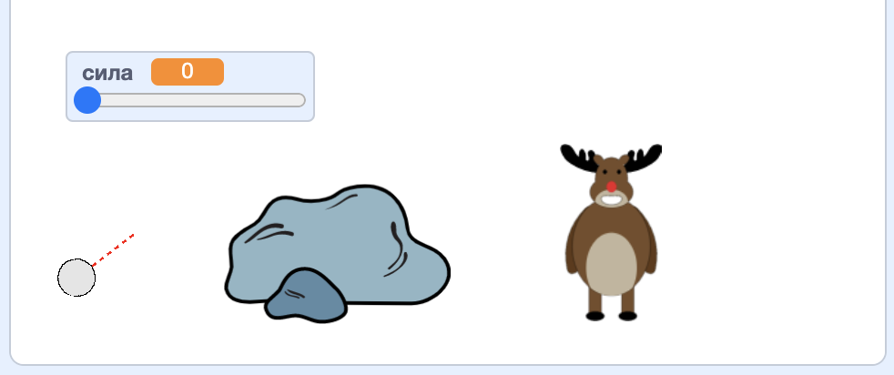

## Ціль

Давай додамо ціль для твоїх сніжок!

--- task ---

Додай ще один спрайт до свого проєкту.



[[[generic-scratch3-sprite-from-library]]]

--- /task ---

--- task ---

Додай цей код до свого нового спрайту, щоб він казав "Ти в мене попав!", коли в нього влучаєш:


```blocks3
when flag clicked
forever
    if < touching [snowball v]? > then
        say [You got me!] for (1) seconds
    end
end
```

--- /task ---

--- task ---

Протестуй свій новий код.



--- /task ---

--- task ---

Давай зробимо декілька речей, щоб зробити гру складнішою. Спочатку, давай переміщувати оленя (reindeer) кожного разу, коли гравець кидає сніжку.

Щоб це зробити, додай `оповіщення`{:class="block3control"} до своєї сніжки біля початку циклу `завжди`{:class="block3control"}. Це дасть оленю знати, що готується новий кидок.


```blocks3
when flag clicked
forever
set [power v] to (0)
+broadcast (new shot v)
wait (0.5) seconds
go to x:(-200) y:(-130)
point in direction (90)
switch costume to (snowball-aim v)
show
repeat until <mouse down?>
    point towards (mouse-pointer v)
end
repeat until < not <mouse down?> >
    point towards (mouse-pointer v)
    change [power v] by (1)
    wait (0.1) seconds
end
broadcast (throw v) and wait
end
```

Коли олень отримає це повідомлення, перемісти його в нове випадкове положення за допомогою цього коду:


```blocks3
when I receive [new shot v]
set x to (pick random (0) to (200))
```

--- /task ---

--- task ---

Протестуй свій код, кидаючи декілька сніжок. Чи переміщується твоя ціль кожного разу?

--- /task ---

--- task ---

Також ти можеш зробити гру складнішою, додавши скелю (rocks) перед твоєю сніжкою.



--- /task ---

--- task ---

Тепер ти можеш змінити свій код для сніжки, щоб вона зупинялася, коли торкається краю сцени, _або_ коли торкається скелі.


```blocks3
when I receive [throw v]
switch costume to (snowball v)
+ repeat until << touching [edge v]? > or <touching [Rocks v]?>>
    change y by (-5)
    move (power) steps
    if <(power) > [0]> then
    change [power v] by (-0.25)
    end
end
hide
```

--- /task ---

--- task ---

Нарешті, ти можеш ускладнити гру, зробивши сніжку та оленя меншими.


--- /task ---
