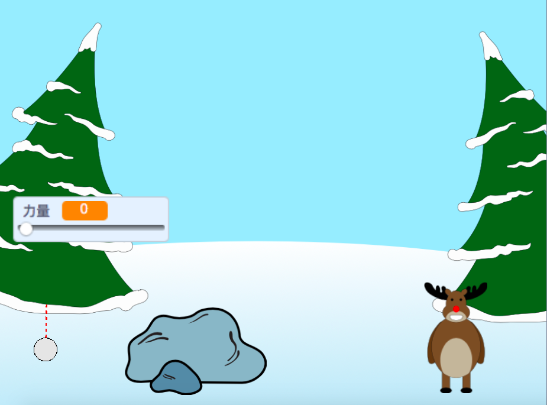

--- no-print ---

這個專案是 **Scratch 3** 版本。 另外還有 [Scratch 2](https://projects.raspberrypi.org/en/projects/snowball-fight-scratch2) 版本。

--- /no-print ---

## 介紹

在這個項目中，您將製作一個遊戲，其中您必須向目標扔雪球。

### 你會做出的玩意兒

--- no-print ---

使用滑鼠來調整雪球的角度，然後按住滑鼠來控制雪球的力道。

  <iframe allowtransparency="true" width="485" height="402" src="https://scratch.mit.edu/projects/embed/302159331/?autostart=true" frameborder="0" scrolling="no"></iframe>
  

--- /no-print ---

--- print-only ---

--- /print-only ---

--- collapse ---
---
title: 你會需要用到
---

### 硬體

+ 能夠運行Scratch的電腦

### 軟體

+ Scratch 3（[線上版](http://rpf.io/scratchon){:target="_blank"} 或 [離線版](http://rpf.io/scratchoff){:target="_blank"}）

### 下載

入門專案[由此下載](http://rpf.io/p/en/snowball-fight-go){:target="_blank"}。

--- /collapse ---

--- collapse ---
---
title: 你會學到
---

- 如何製作動畫
- 如何對滑鼠的輸入做出反應
- 如何使用廣播

--- /collapse ---

--- collapse ---
---
title: 給教師的其它資訊
---

--- no-print ---

如果你需要列印這個專案，可以先切換成[列印友好模式](https://projects.raspberrypi.org/en/projects/snowball-fight/print){:target="_blank"}。

--- /no-print ---

你可以在這裡找到[已經完成的專案](http://rpf.io/p/en/snowball-fight-get){:target="_blank"}。

--- /collapse ---
