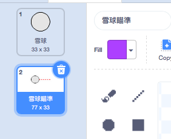
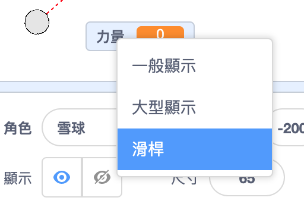
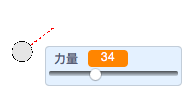

## 製作雪球

讓我們做一個雪球，讓你可以在舞台上亂扔。

--- task ---

打開Scratch入門專案。

**線上版**: 開啟 [入門專案](https://scratch.mit.edu/projects/399467162){:target="_blank"}.

如果你有 Scratch 帳戶，你就可以直接**改編**專案。

**離線版**：在離線編輯器裡開啟[入門專案](http://rpf.io/p/zh-TW/snowball-fight-go){:target="_blank"}。

如果你需要 Scratch 離線版編輯器，可以在這找到 [rpf.io/scratchoff](http://rpf.io/scratchoff){:target="_blank"}。

在入門專案中，你應該可以看到空白的舞台以及雪球角色。

--- /task ---

--- task ---

「雪球」角色包含兩種造型，一種是普通造型，另一種是顯示雪球面向哪個方向的造型。



--- /task ---

--- task ---

首先，讓玩家改變雪球的角度。 為你的雪球編寫程式


```blocks3
when flag clicked
wait (0.5) seconds
go to x:(-200) y:(-130)
point in direction (90)
switch costume to (雪球瞄準 v)
repeat until <mouse down?>
    point towards (mouse-pointer v)
end
```

--- /task ---

--- task ---

點擊綠旗測試你的程式 你將會看到雪球跟著滑鼠移動，直到你按下滑鼠按鍵。


--- /task ---

--- task ---

讓玩家決定應該扔多大力。 建立一個新的變數，名稱叫`力量`{:class="block3variables"}。

[[[generic-scratch3-add-variable]]]

--- /task ---

--- task ---

將你新的可變顯示器拉到靠近雪球的舞台底部。 在可變顯示器上點右鍵，然後選擇"滑桿"



--- /task ---

--- task ---

當你點擊綠旗時，增加程式碼來設置新的`力量`{:class="block3variables"}變數為0，。


```blocks3
when flag clicked
+ set [力量 v] to (0)
```

--- /task ---

--- task ---

現在您有了一個`力量`{:class="block3variables"}變數，選擇了雪球的方向_之後_你可以透過此程式碼來增加雪球的力量：


```blocks3
repeat until <mouse down?>
    point towards (mouse-pointer v)
end
+repeat until < not <mouse down?> >
    point towards (mouse-pointer v)
    change [力量 v] by (1)
    wait (0.1) seconds
end
```

此程式碼表示您必須在選擇方向後_按住滑鼠按鍵_，選擇雪球的力量。

--- /task ---

--- task ---

測試你的雪球，看看你是否可以選擇它的角度和力量。



--- /task ---
