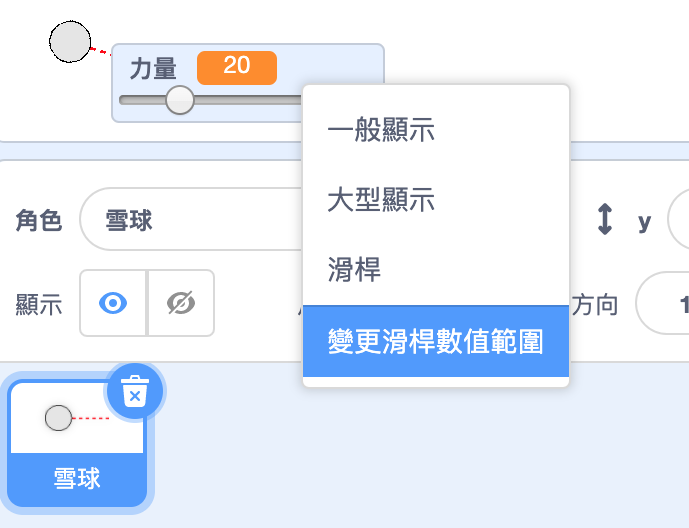

## 真實的移動

你現在有了一個雪球，但讓它移動的更真實。

--- task ---

首先，讓我們設置最大力量等級，以免雪球扔得太用力。

在你的雪球`當旗子被點擊` {：class =“ block3events”}程式碼，僅當如果力量小於20時，我們才需要增加力量。 將你的程式更改為：


```blocks3
repeat until< not <mouse down?> >
+   if < (力量) < [20] > then
        change [力量 v] by (1)
        wait (0.1) seconds
    end
end
```

--- /task ---

--- task ---

再次測試你的雪球，你將看到力量永遠不會超過20。

--- /task ---

--- task ---

現在，雪球的最大力量為20，您也可以將其設置為變量滑桿的最大值。 右鍵點擊你的力量變數，然後點擊「設置滑桿的最小值和最大值」。




--- /task ---

--- task ---

你還可以通過在空中飛行時略微降低力量來減慢雪球運動的速度。 添加此程式積木到您的雪球` 當我收到 [丟]時` {：class =“ block3events”}程式碼：


```blocks3
when I receive [throw v]
switch costume to (snowball v)
repeat until < touching [edge v]? >
    move (power) steps
+   change [power v] by (-0.25)
end
hide
```

--- /task ---


--- task ---

Test this new code - does it work as you expected? You may notice that the power keeps reducing, and eventually the snowball moves backwards!

To fix this, you can add an `if`{:class="block3control"} block to your code, so that the power is only lowered if it is above 0:


```blocks3
when I receive [throw v]
switch costume to (snowball v)
repeat until < touching [edge v]? >
    move (power) steps
+   if < (power) > (0) > then
        change [power v] by (-0.25)
    end
end
hide
```

--- /task ---

--- task ---

You're nearly there, but you also need to add some gravity to your snowball, so that it falls to the ground. You can add gravity by just moving the snowball down continuously with this code:


```blocks3
when I receive [throw v]
switch costume to (snowball v)
repeat until < touching [edge v]? >
+   change y by (-5)
    move (power) steps
    if < (power) > (0) > then
        change [power v] by (-0.25)
    end
end
hide
```

--- /task ---

--- task ---

Test out your snowball again, and you should see that your snowball moves much more realistically.

--- /task ---

