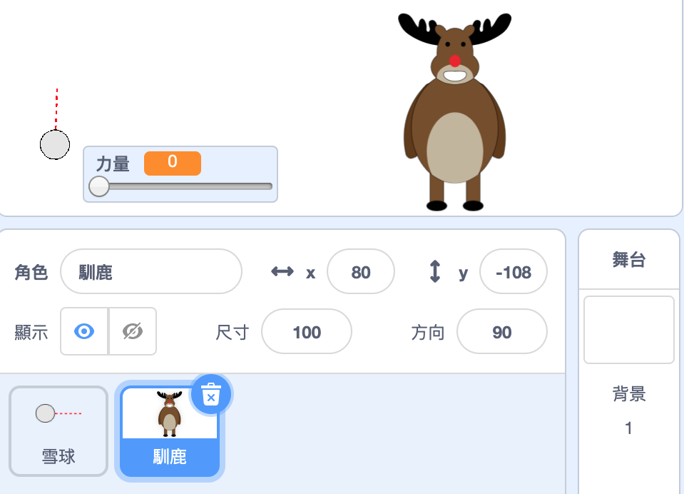

## 目標物

讓我們為你的雪球添加一個目標！

--- task ---

在你的專案中添加另一個角色。



[[[generic-scratch3-sprite-from-library]]]

--- /task ---

--- task ---

將此程式添加到新的角色中。讓它被擊中時，它會說「你打到我了！」：


```blocks3
when flag clicked
forever
    if < touching [雪球 v]? > then
        say [你打到我了!] for (1) seconds
    end
end
```

--- /task ---

--- task ---

測試你的新程式。


--- /task ---

--- task ---

讓我們來做一些讓遊戲變得更加困難的事情。 首先，讓我們在玩家每次扔雪球時馴鹿都會移動。

為了這個，要先添加一個`廣播` {：class =“ block3control”}到你的雪球，在你的`重複無限次` {：class =“ block3control”}迴圈的最上面。 這將讓你的馴鹿知道新的一輪即將開始了。


```blocks3
when flag clicked
forever
set [力量 v] to (0)
+broadcast (新的一輪 v)
wait (0.5) seconds
go to x:(-200) y:(-130)
point in direction (90)
switch costume to (雪球瞄準 v)
show
repeat until <mouse down?>
    point towards (鼠標 v)
end
repeat until < not <mouse down?> >
    point towards (鼠標 v)
    change [力量 v] by (1)
    wait (0.1) seconds
end
broadcast (丟 v) and wait
end
```

當你的馴鹿接收到這個訊息，它將會利用這個程式移動到新的隨機位置：


```blocks3
when I receive [新的一輪 v]
set x to (pick random (0) to (200))
```

--- /task ---

--- task ---

扔一些雪球來測試你的專案。 目標每次都會移動位置嗎？

--- /task ---

--- task ---

您還可以在雪球前面加一塊石頭來增加遊戲難度。


--- /task ---

--- task ---

您現在可以更改雪球程式，讓它在碰到螢幕邊緣_或_碰到石頭時會停止。


```blocks3
when I receive [丟 v]
switch costume to (雪球 v)
+ repeat until << touching [邊緣 v]? > or < touching [石頭 v]? >>
    change y by (-5)
    move (力量) steps
    if <(力量) > [0]> then
    change [力量 v] by (-0.25)
    end
end
hide
```

--- /task ---

--- task ---

最後，您可以讓雪球和麋鹿變小來提高遊戲的難度。


--- /task ---
